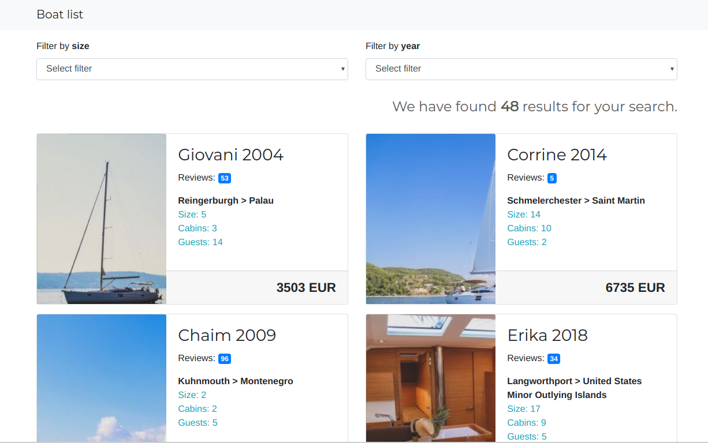

# BOAT LIST

A React App that shows a list of active boats using GraphQL.



### Stack

- React
- GraphQL

### Running the project
```bash
yarn install

yarn start
```

After running `yarn start` you'll be able to see the application running at [http://localhost:3000](http://localhost:3000)
